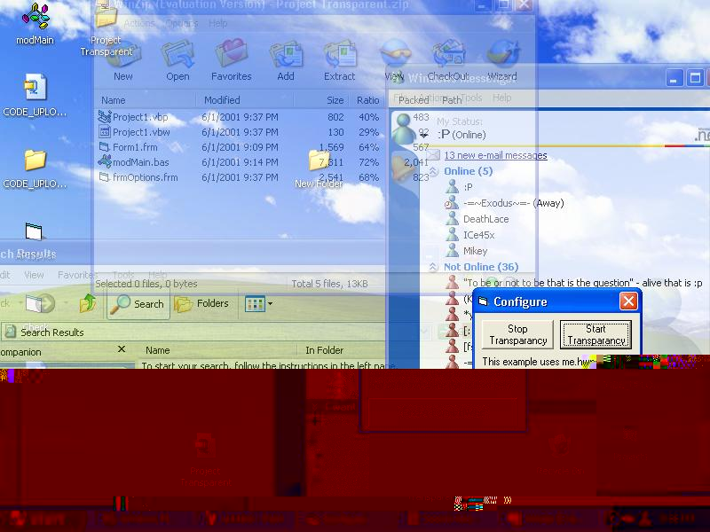



## Make ANY window transparent

### Description

Thes peice of code will mkae ANY open window transparent ;).
 
### More Info
 

             |
---                |---
**Submitted On**   |2001-06-01 21:37:38
**By**             |[Christopher Hemple](https://github.com/Planet-Source-Code/PSCIndex/blob/master/ByAuthor/christopher-hemple.md)
**Level**          |Intermediate
**User Rating**    |5.0 (10 globes from 2 users)
**Compatibility**  |VB 5\.0, VB 6\.0
**Category**       |[Windows API Call/ Explanation](https://github.com/Planet-Source-Code/PSCIndex/blob/master/ByCategory/windows-api-call-explanation__1-39.md)
**World**          |[Visual Basic](https://github.com/Planet-Source-Code/PSCIndex/blob/master/ByWorld/visual-basic.md)
**Archive File**   |[Make\_ANY\_w1003556302002\.zip](https://github.com/Planet-Source-Code/christopher-hemple-make-any-window-transparent__1-36411/archive/master.zip)

